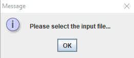
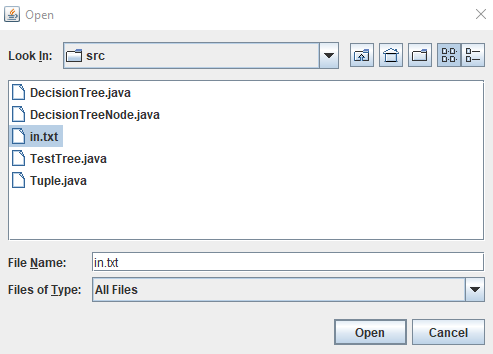
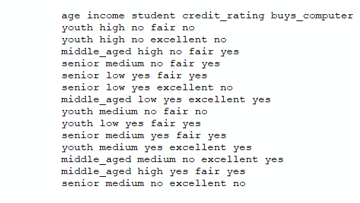
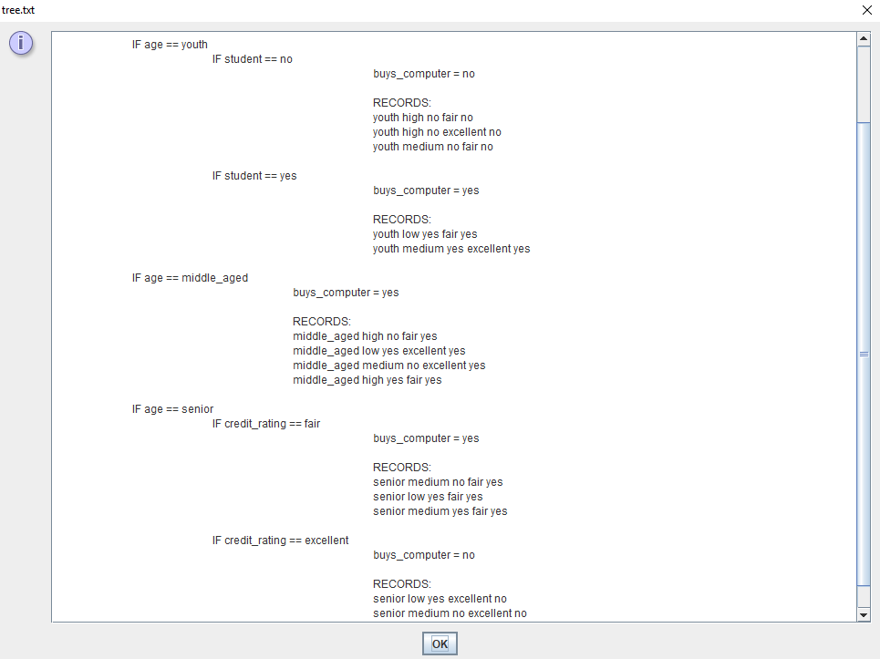
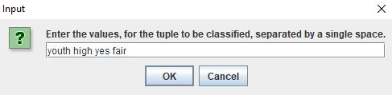
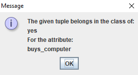

# Decision Tree Generator

## Contents

- [**About**](#about)
- [**Step 1 - User Prompted to Select Input File**](#step-1---user-prompted-to-select-input-file)
- [**Step 2 - Decision Tree Displayed**](#step-2---decision-tree-displayed)
- [**Step 3 - Query Tuple Provided**](#step-3---query-tuple-provided)
- [**Step 4 - Prediction**](#step-4---prediction)
- [**Demo**](#demo)

## About

Decision Trees are a way of finding correlations in people's behavior from data about their habits. This program builds a decision tree based on a given input file and then proceeds to classify a user-provided tuple of data. In the example below, the input file holds information that a compputer manufacturing company has collected about their customers. The *Decision Tree Generator* will attempt to find other factors and combinations of factors (such as age, income, and student status) related to that a customer's is likeliness to make a purchase.
 		
## Step 1 - User Prompted to Select Input File

### Prompt

The program prompts the user fo choose an input file containing the data that is to be used for generating a decision tree.

### File Chosen

The program uses *Java*'s *Jfilechooser* object for allowing the user to choose the input file through a GUI.

### Contents of in.txt

This is sample information that a computer manufacturing company has collected about their customers. The first row of the input file provides the names of attributes while the rest of the rows are collected data points corresponding to those attributes. In this example input file the attributes are:

- age
- income
- student
- credit_rating
- buys_computer

Reading the second row, we can see it belongs to a customer who falls in the ***youth*** age class, the ***high*** income class, the ***no*** student class, the ***fair*** credit rating class, and the ***no*** buys_computer class. So this person is young, makes high income, is not a student, has a fair credit rating, and *did not buy a computer*.

## Step 2 - Decision Tree Displayed

Here, the decision tree is displayed in a *JTextArea* object. The root of the tree will be the attribute with the highest calculated entropy and is used to produce the first *split* in the tree. Entropy is an estimate of the information that could be gained by splitting  that decision tree using a given attribute. In the image below, we can see that the attribute with the highest calculated entropy was ***age*** and the possible classes include ***youth, middle_aged, or senior***. The attribute with the highest entropy is selected in order to keep the tree as small as possible.

## Step 3 - Query Tuple Provided

User provides a data point in the form of a tuple, excluding the value for the attribute that is being predicted. The tuple provided here is young, makes high income, is a student, and has fair credit. 

## Step 4 - Prediction

A simple prediction is displayed in the message dialog box which indicates the class prediction for the attribute ***buys_computer***.

## Demo

